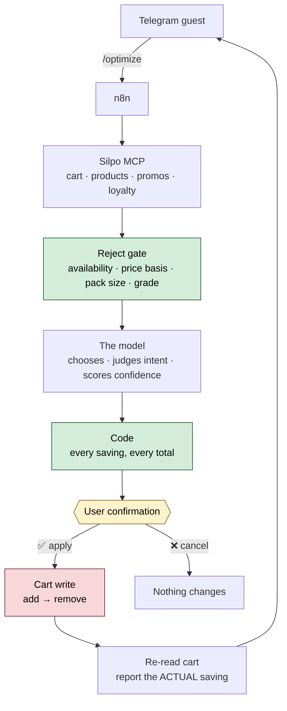

<div align="center">

# 🛒 Silpo Shopping Optimizer

**A Telegram agent that lowers the cost of an existing Silpo cart — without changing what the customer actually buys.**

[](tsconfig.json)
[](package.json)
[](workflows/)
[](docs/mcp-tools.md)
[](#quick-start)

</div>

---

Milk 2.5% gets replaced by other milk 2.5% — never by a plant drink. A protein
dessert is not swapped for a plain sweet one. A lactose-free product is not
quietly downgraded to a regular one.

**Cheaper is not the goal. Preserving the purchase is.**

```
Before     1970.96 UAH
After      1950.96 UAH
────────────────────────
Saving       20.00 UAH   1.0%

19 items · 2 replacements · 468 candidates rejected
6 model calls · 12.7 s
```

<sub>Real numbers from a real cart on 2026-08-17 — not a mockup, and deliberately
not the largest figure this project has printed. An earlier engine reported
103.00 UAH on this same cart and 72.40 of it came from comparing a per-kilogram
price against a per-pack one. The gate that removed it is why the honest number
is small. Savings scale with the basket, not with the engine: a 22-item cart
measured 818–1524 UAH across the three modes. See
[engine-findings.md](docs/engine-findings.md).</sub>

> **The model chooses, so the figure moves.** Two runs over identical input
> measured 37.50 and 40.00 UAH. Quote a range, never a single number.

---

## How it works



1. The guest connects their Silpo account through **OAuth 2.1 + PKCE**.
2. For every cart line the agent pulls similar products, replacements,
   promotions, coupons and the loyalty balance.
3. A **deterministic gate** throws out everything the API settles outright:
   unavailable, not cheaper, a different price basis, a pack size outside the
   band, a different fat grade. It decides facts only — never what a product is
   *for*. On a 19-line cart it rejected 468 candidates and handed the model a
   shorter, honest pool.
4. **The model decides.** It picks the replacement for each line, judges whether
   the purchase survives, and returns a confidence. It reads prices to choose,
   but returns indices and words — **every figure is computed in code** from MCP
   prices. That split was measured: asked to do its own arithmetic, the model got
   2 of 16 savings wrong on a live cart, both on weighted lines.
5. **Confidence changes what happens.** Above the mode's tick bar a replacement
   is offered and ticked; between the two bars it is offered, explained and left
   unticked; below, it is not offered at all. The card lists each replacement
   with a checkbox — untick anything you want to keep, and the totals recalculate
   in place. Settings carries three modes (`conservative` / `balanced` / `max`)
   that move the pack-size band and how much is shown, never how much is applied
   unread. Brands you never want offered go on a blocklist with `/block`.
6. Every line that has confirmed runners-up carries **«Інші варіанти»**: the run
   keeps up to two beside the pick it made, and choosing one swaps it in as an
   ordinary replacement — the saving and the headline follow, the checkbox does
   not move, and nothing is searched or judged again.
7. If the cart reveals the chosen product is the wrong pack size or out of stock,
   the next-best candidate goes in instead. Candidates now carry a pack size
   (`displayRatio`), but the cart's own `ratio` is the only authority, so the
   band is re-checked after the add and a mismatch is rolled back.
8. **Nothing is written until the guest taps ✅.** Afterwards the cart is re-read
   and the reported saving is the actual difference, not the prediction — closed
   with a wish, the way Silpo closes a till receipt.

---

## Quick start

No build step — Node 22 runs the TypeScript directly, and there are no runtime
dependencies.

```bash
npm install
npm run authorize     # sign in to Silpo, dump all 39 tool schemas
npm run optimize      # analyze your real cart — read-only
```

`npm run authorize` opens a browser, you sign in with your own Silpo account, and
the tokens stay in `.secrets/` (gitignored, mode 0600). Nothing is shared.

To deploy the bot you also need your own n8n instance and data tables; put their
ids in `.secrets/n8n.json` and rebuild — see [docs/setup.md](docs/setup.md).

> `npm run optimize` calls **no write tools**. Cart changes happen only through
> the bot, after an explicit confirmation.

Deploying the bot: **[docs/setup.md](docs/setup.md)** — ten steps from an empty
n8n instance to a working agent.

| Command | What it does |
|---|---|
| `npm run authorize` | OAuth 2.1 + PKCE flow, writes real tool schemas to `data/` |
| `npm run optimize` | Full analysis pipeline against the live cart |
| `npm run optimize -- --dump` | Write the cart and every candidate pool to `.secrets/fixture.json` and stop before the model |
| `npm run call -- <tool> '<json>'` | Invoke any MCP tool directly |
| `npm run check` | Typecheck → test → rebuild workflows → validate → check the screens |
| `npm test` | Offline tests for the gate and the arithmetic — no network |
| `npm run preview` | Render every Telegram screen out of the generated JSON |
| `npm run setup:commands` | Register the bot's «/» command menu with Telegram |
| `npm run test:node` | Execute a generated Code node against live MCP |

---

## Layout

```
src/lib/          mcp.ts · optimizer/ · ui.ts · types.ts · engine.test.ts
src/lib/optimizer/  ai-client · ai-selector · prompts · schemas · candidate-filter
                    product-utils · optimization-modes · confidence · plan-builder
src/cli/          authorize · call-tool · optimize · set-commands
src/workflow/     build · validate · screens · test-node
workflows/        generated n8n JSON — import these
docs/             architecture · mcp-reference · engine-findings · setup · roadmap
data/             raw tools/list dump from the live server
```

One module per responsibility: `candidate-filter` is the gate, `ai-selector` is
the model's judgement, `plan-builder` is every figure. `src/lib/ui.ts` holds
every guest-facing string and keyboard, and nothing outside it does.

### One source of truth

The optimization engine lives in one place,
[`src/lib/optimizer/`](src/lib/optimizer/) — one module per responsibility
behind [`index.ts`](src/lib/optimizer/index.ts) — and is **inlined into the n8n
Code nodes by the generator** rather than copied by hand:

```
src/lib/optimizer/*.ts ──transpile──> Code nodes ──> workflows/*.json
```

Change the logic there, run `npm run build:workflows`, and the workflow cannot
drift from what was tested locally.

`npm run validate` checks what actually breaks an import: dangling connections,
orphan nodes, Code nodes that do not compile, top-level name collisions between
the inlined engine and a node's own helpers, MCP tool names absent from
`tools/list`, and secrets accidentally baked into the JSON.

`npm run preview` goes one step further and renders every screen the way Telegram
paints it — bold, italic, strikethrough, buttons — out of the generated JSON.
`npm run preview -- --check` runs its assertions alone and is part of
`npm run check`, so a screen that breaks a copy rule fails the build rather than
reaching a guest.

---

## Two decisions worth knowing

**MCP is called directly, not through the n8n MCP node.** That node holds one
static credential per workflow — one Silpo account shared by every user, which
would leak one customer's cart to another. Instead each call carries the bearer
token of whichever guest triggered the run, loaded from storage and decrypted in
memory.

**No application registration is needed.** Silpo supports Dynamic Client
Registration (`POST /register` → `201`, no `client_secret`), so the workflow
obtains its own `client_id` at runtime.

Full rationale: **[docs/architecture.md](docs/architecture.md)**.

---

## What is verified, and what is not

**Verified** against the live server and a real cart:

- ✅ OAuth 2.1 + PKCE end to end; tokens last 30 days and refresh
- ✅ `tools/list` — 39 tools, schemas in [`data/mcp-tools.json`](data/mcp-tools.json)
- ✅ Full read pipeline: 22 MCP calls, 2.1 s, no rate limiting hit
- ✅ **The model engine on live carts** — 14, 19 and 22 lines, several runs each,
  with the token cost measured (\$0.097 per analysis, ~51 runs per \$5)
- ✅ **The arithmetic** — 17 of 17 lines re-checked digit for digit against a
  deterministic recomputation, weighted lines included
- ✅ The generated Code node executed straight from the workflow JSON against live MCP
- ✅ **The full flow in n8n**: `/start` → `/connect` → OAuth → `/optimize` → details → apply
- ✅ **Cart writes on a real cart**, with verification reporting the actual total
- ✅ The size guard firing for real — a smoothie kept its name but changed from
  700 ml to 250 ml, and was rolled back instead of applied

**Not verified** — stated plainly rather than implied:

- ❌ **The deployed bot end to end since the engine became all-model.** The
  workflow builds, validates and every Code node compiles, and the engine is
  measured from the CLI — but the apply path in particular (one model call per
  line inside a single Code node, under n8n's execution timeout) has not run
  against Telegram since the change. The ✅ above for the full flow was earned by
  the deterministic engine that preceded it
- ❌ Coupons, promo codes and personal promos. All three tools returned empty on
  the test account, so applicability could never be proven — which is why the
  card shows a **count** and never a sum
- ❌ Why two adds were refused during the first live apply. The cause was masked
  by a hardcoded guess in the error message; the products were in stock. Error
  reporting now passes Silpo's own wording through

---

## Known limits

> **Results are not reproducible.** The model picks the replacement, and it does
> not pick the same one twice: measured spreads of 6–40% on identical input. Any
> figure quoted from this bot is a range, and a demo that promises one number
> will be wrong on the second run.

- **There is no fallback.** Selection is the model's, entirely. If the API call
  fails the run stops with `AI unavailable` rather than proposing something a
  rule invented — a fallback made unverifiable claims about money that looked
  exactly like real ones. The single deliberate exception is the receipt wish,
  which carries no number and is written after the cart has already changed.
- **Savings are not guaranteed.** A cart of already-cheap items yields 0 UAH, and
  the bot says so rather than inventing a recommendation.
- **Pack size is now readable, but only the cart is authoritative.** Candidates
  carry `displayRatio` since silpo-mcp-service v1.108.0 — which is what let the
  engine stop recommending smaller packs as bargains. Where it cannot be parsed
  the replacement is flagged `verifySize` and re-checked against the cart's own
  `ratio` after the add, and rolled back on a mismatch.
- **Loyalty bonuses are never counted as savings.** They are reported separately
  as potential, because only a checkout response can confirm them.
- **Promotions already in the cart are stated, never added.** `subDiscount` is
  money the guest already has; summing it into the headline would have inflated
  one measured cart seventeenfold.
- **Multi-buy promotions are not modelled.** `specialPrices` ("2 for 119 each")
  is present on candidates and absent from cart lines, so the comparison has only
  one side — and acting on it would change what the guest buys.

Every one of these is measured rather than assumed; the numbers are in
[engine-findings.md](docs/engine-findings.md).

---

## Hackathon compliance

Requirements from the Silpo AI Factory rules, and how this project meets them:

| Requirement | Status |
|---|---|
| Connects to the official `https://mcp.silpo.ua/mcp`, no third-party APIs or scraping | ✅ sole data source |
| Calls at least one tool from `tools/list` in a working agent scenario | ✅ 13 tools in the pipeline, 11 read and 2 write |
| Working prototype with the call visible in a demo, log or trace | ✅ `npm run optimize` prints a full JSON-RPC trace |
| Tokens stored server-side, never in client code | ✅ AES-256-GCM at rest; Telegram receives only a `plan_id` |
| Agentic — uses tools and sequences actions, not just text generation | ✅ 22 calls per run, gated write path, verification loop |

---

## Documentation

| Document | Contents |
|---|---|
| [architecture.md](docs/architecture.md) | Component design, OAuth flow, pipeline, write safety, risks |
| [mcp-reference.md](docs/mcp-reference.md) | What the API actually does — including where it contradicts its own docs |
| [mcp-tools.md](docs/mcp-tools.md) | All 39 tool schemas, generated from the live server |
| [engine-findings.md](docs/engine-findings.md) | Measured results — the gate's rejections, the confidence bands, the modes, token cost, and every defect found on the way |
| [setup.md](docs/setup.md) | Deployment, credentials, test scenario, troubleshooting |
| [roadmap.md](docs/roadmap.md) | Three further agents on the same foundation |
| [brief.md](docs/brief.md) | The original brief, verbatim (Ukrainian) |

---

## Running your own

This is a hackathon project built against a live account, so it carries no
deployment of its own:

- `.secrets/` holds tokens, the Telegram bot token and `n8n.json` with your
  instance URL and data table ids. It is gitignored in full.
- The committed workflow JSON is generated **from placeholders**, so it carries
  no one's instance URL or table ids. `npm run build:workflows` also writes a
  copy wired to your `.secrets/n8n.json` under `.secrets/workflows/` — import
  that one. The tracked files stay byte-identical on every machine, so a rebuild
  never dirties the working tree.
- No Silpo credentials, cart contents or personal data are stored in the
  repository. `npm run validate` fails the build if a token, key or connection
  string ends up in the workflow JSON.

## Language

Code, comments and documentation are English. Strings the customer reads in
Telegram — and the model prompts that produce them — are Ukrainian, since the bot
serves Silpo guests. Every one of them lives in
[`src/lib/ui.ts`](src/lib/ui.ts) and the prompts in
[`src/lib/optimizer/prompts.ts`](src/lib/optimizer/prompts.ts); nowhere else. In
particular they are **not** in the generator's template literals, where every
escape would be processed twice.

---

<div align="center">
<sub>Built on the official Silpo MCP · Every number above was measured against the live server, and what was not measured is listed as such.</sub>
</div>
