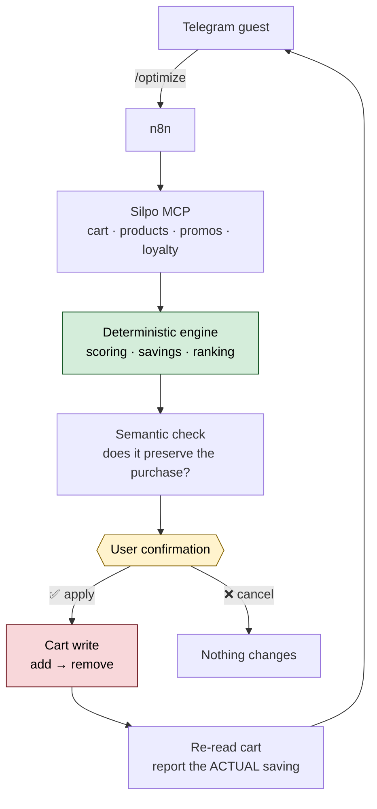

<div align="center">

# 🛒 Silpo Shopping Optimizer

**A Telegram agent that lowers the cost of an existing Silpo cart — without changing what the customer actually buys.**

[](tsconfig.json)
[](package.json)
[](workflows/)
[](docs/mcp-tools.md)
[](#quick-start)

</div>

---

Milk 2.5% gets replaced by other milk 2.5% — never by a plant drink. A protein
dessert is not swapped for a plain sweet one. A lactose-free product is not
quietly downgraded to a regular one.

**Cheaper is not the goal. Preserving the purchase is.**

```
Before     1042.30 UAH
After       945.49 UAH
────────────────────────
Saving       96.81 UAH   9.3%

14 items · 5 replacements · 4 on promotion
22 MCP calls · 0 retries · 2.1 s
```

<sub>Real numbers from a real cart on 2026-08-12 — not a mockup. See [engine-findings.md](docs/engine-findings.md).</sub>

---

## How it works



1. The guest connects their Silpo account through **OAuth 2.1 + PKCE**.
2. For every cart line the agent pulls similar products, replacements,
   promotions, coupons and the loyalty balance.
3. A **deterministic engine** scores candidates and computes savings.
   Prices come only from MCP responses — the model never produces a number.
4. A **semantic layer** rejects replacements that change the purchase intent.
5. The card lists each replacement with a checkbox — untick anything you want to
   keep, and the totals recalculate in place. Brands you never want offered go on
   a blocklist with `/block`.
6. If the cart reveals the chosen product is the wrong pack size or out of stock,
   the next-best candidate goes in instead — sizes are invisible until an item is
   in the cart.
7. **Nothing is written until the guest taps ✅.** Afterwards the cart is re-read
   and the reported saving is the actual difference, not the prediction — closed
   with a wish, the way Silpo closes a till receipt.

---

## Quick start

No build step — Node 22 runs the TypeScript directly, and there are no runtime
dependencies.

```bash
npm install
npm run authorize     # sign in to Silpo, dump all 39 tool schemas
npm run optimize      # analyze your real cart — read-only
```

`npm run authorize` opens a browser, you sign in with your own Silpo account, and
the tokens stay in `.secrets/` (gitignored, mode 0600). Nothing is shared.

To deploy the bot you also need your own n8n instance and data tables; put their
ids in `.secrets/n8n.json` and rebuild — see [docs/setup.md](docs/setup.md).

> `npm run optimize` calls **no write tools**. Cart changes happen only through
> the bot, after an explicit confirmation.

Deploying the bot: **[docs/setup.md](docs/setup.md)** — ten steps from an empty
n8n instance to a working agent.

| Command | What it does |
|---|---|
| `npm run authorize` | OAuth 2.1 + PKCE flow, writes real tool schemas to `data/` |
| `npm run optimize` | Full analysis pipeline against the live cart |
| `npm run call -- <tool> '<json>'` | Invoke any MCP tool directly |
| `npm run check` | Typecheck → test → regenerate workflows → validate them |
| `npm test` | Offline tests for the gate and the arithmetic — no network |
| `npm run test:node` | Execute a generated Code node against live MCP |

---

## Layout

```
src/lib/          mcp.ts · optimizer.ts · ai-ranker.ts · types.ts
src/cli/          authorize · call-tool · optimize
src/workflow/     build · validate · test-node
workflows/        generated n8n JSON — import these
docs/             architecture · mcp-reference · engine-findings · setup · roadmap
data/             raw tools/list dump from the live server
```

### One source of truth

The optimization engine lives in a single file,
[`src/lib/optimizer.ts`](src/lib/optimizer.ts), and is **inlined into the n8n
Code nodes by the generator** rather than copied by hand:

```
src/lib/optimizer.ts ──transpile──> Code nodes ──> workflows/*.json
```

Change the logic there, run `npm run build:workflows`, and the workflow cannot
drift from what was tested locally.

`npm run validate` checks what actually breaks an import: dangling connections,
orphan nodes, Code nodes that do not compile, MCP tool names absent from
`tools/list`, and secrets accidentally baked into the JSON.

---

## Two decisions worth knowing

**MCP is called directly, not through the n8n MCP node.** That node holds one
static credential per workflow — one Silpo account shared by every user, which
would leak one customer's cart to another. Instead each call carries the bearer
token of whichever guest triggered the run, loaded from storage and decrypted in
memory.

**No application registration is needed.** Silpo supports Dynamic Client
Registration (`POST /register` → `201`, no `client_secret`), so the workflow
obtains its own `client_id` at runtime.

Full rationale: **[docs/architecture.md](docs/architecture.md)**.

---

## What is verified, and what is not

**Verified** against the live server and a real cart:

- ✅ OAuth 2.1 + PKCE end to end; tokens last 30 days and refresh
- ✅ `tools/list` — 39 tools, schemas in [`data/mcp-tools.json`](data/mcp-tools.json)
- ✅ Full read pipeline: 22 MCP calls, 2.1 s, no rate limiting hit
- ✅ The generated Code node executed straight from the workflow JSON against live MCP
- ✅ **The full flow in n8n**: `/start` → `/connect` → OAuth → `/optimize` → details → apply
- ✅ **Cart writes on a real cart**, with verification reporting the actual total
- ✅ The size guard firing for real — a smoothie kept its name but changed from
  700 ml to 250 ml, and was rolled back instead of applied

**Not verified** — stated plainly rather than implied:

- ❌ The model call — currently built out of the workflow (`AI_SEMANTIC_CHECK = false`);
  the deterministic fallback runs instead
- ❌ Why two adds were refused during the first live apply. The cause was masked
  by a hardcoded guess in the error message; the products were in stock. Error
  reporting now passes Silpo's own wording through

---

## Known limits

> **Pack size is unavailable for candidates.** Silpo exposes `ratio` on cart
> lines but on no search result, and **0 of 180** candidate names contained one.
> The 10% size weight in the ranking formula is therefore inert, and a large
> price drop may mean a smaller package rather than a better deal.

Such replacements are flagged `verifySize` and shown with a ⚠️ warning before
confirmation. During apply the check becomes exact: replacements are added to the
cart first, where `ratio` *is* exposed, so a wrong pack size is caught and rolled
back instead of silently swapped. Details in
[engine-findings.md](docs/engine-findings.md).

- **Savings are not guaranteed.** A cart of already-cheap items yields 0 UAH, and
  the bot says so rather than inventing a recommendation.
- **Loyalty bonuses are never counted as savings.** They are reported separately
  as potential, because only a checkout response can confirm them.

---

## Hackathon compliance

Requirements from the Silpo AI Factory rules, and how this project meets them:

| Requirement | Status |
|---|---|
| Connects to the official `https://mcp.silpo.ua/mcp`, no third-party APIs or scraping | ✅ sole data source |
| Calls at least one tool from `tools/list` in a working agent scenario | ✅ 12 tools in the pipeline |
| Working prototype with the call visible in a demo, log or trace | ✅ `npm run optimize` prints a full JSON-RPC trace |
| Tokens stored server-side, never in client code | ✅ AES-256-GCM at rest; Telegram receives only a `plan_id` |
| Agentic — uses tools and sequences actions, not just text generation | ✅ 22 calls per run, gated write path, verification loop |

---

## Documentation

| Document | Contents |
|---|---|
| [architecture.md](docs/architecture.md) | Component design, OAuth flow, pipeline, write safety, risks |
| [mcp-reference.md](docs/mcp-reference.md) | What the API actually does — including where it contradicts its own docs |
| [mcp-tools.md](docs/mcp-tools.md) | All 39 tool schemas, generated from the live server |
| [engine-findings.md](docs/engine-findings.md) | Measured results, rejected replacements, ranking formula |
| [setup.md](docs/setup.md) | Deployment, credentials, test scenario, troubleshooting |
| [roadmap.md](docs/roadmap.md) | Three further agents on the same foundation |
| [brief.md](docs/brief.md) | The original brief, verbatim (Ukrainian) |

---

## Running your own

This is a hackathon project built against a live account, so it carries no
deployment of its own:

- `.secrets/` holds tokens, the Telegram bot token and `n8n.json` with your
  instance URL and data table ids. It is gitignored in full.
- The committed workflow JSON is generated **from placeholders**, so it carries
  no one's instance URL or table ids. `npm run build:workflows` also writes a
  copy wired to your `.secrets/n8n.json` under `.secrets/workflows/` — import
  that one. The tracked files stay byte-identical on every machine, so a rebuild
  never dirties the working tree.
- No Silpo credentials, cart contents or personal data are stored in the
  repository. `npm run validate` fails the build if a token, key or connection
  string ends up in the workflow JSON.

## Language

Code, comments and documentation are English. Strings the customer reads in
Telegram — and the model prompt that produces them — are Ukrainian, since the bot
serves Silpo guests. They are all in
[`src/workflow/build.ts`](src/workflow/build.ts) if that needs to change.

---

<div align="center">
<sub>Built on the official Silpo MCP · Every claim above was verified against the live server.</sub>
</div>
